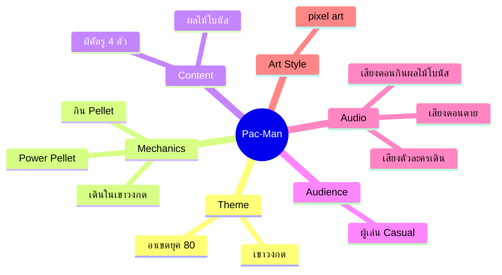
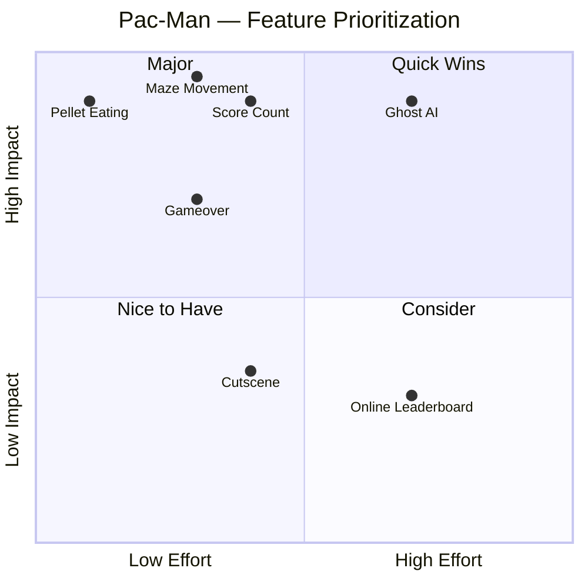
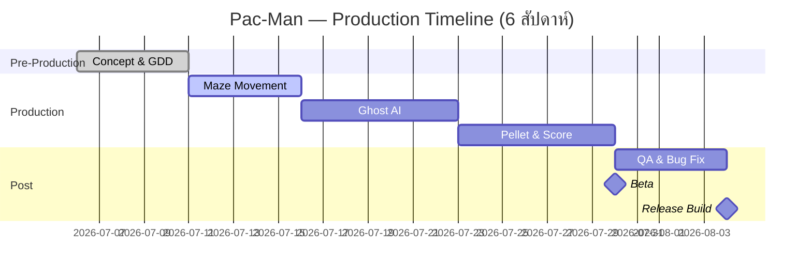

```mermaid
mindmap
root((Pac-Man))
 Theme
  เขาวงกต
  อาเขตยุค 80
 Mechanics
  เดินในเขาวงกต
  กิน Pellet
  Power Pellet
 Content
  ผีศัตรู 4 ตัว
  ผลไม้โบนัส
 Audience
  ผู้เล่น Casual
 Audio
  เสียงตัวละครเดิน
  เสียงตอนตาย
  เสียงตอนกินผลไม้โบนัส
 Art Style
  pixel art
```

```mermaid
quadrantChart
title Pac-Man — Feature Prioritization
x-axis Low Effort --> High Effort
y-axis Low Impact --> High Impact
quadrant-1 Quick Wins 
quadrant-2 Major
quadrant-3 Nice to Have
quadrant-4 Consider
Maze Movement: [0.3, 0.95]
Ghost AI: [0.7, 0.9]
Online Leaderboard: [0.7, 0.3]
Pellet Eating: [0.1, 0.9]
Score Count: [0.4, 0.9]
Cutscene: [0.4, 0.35]
Gameover: [0.3, 0.7]
```

Comment: MVP ซ้ายบน = Pellet Eating, MVP ขวาบน = Ghost AI, ตัด Cutscene กับ Online Leaderboard

```mermaid
gantt
title Pac-Man — Production Timeline (6 สัปดาห์)
dateFormat YYYY-MM-DD
section Pre-Production
Concept & GDD :done, c1, 2026-07-06, 5d
section Production
Maze Movement :active, p1, after c1, 5d
Ghost AI : p2, after p1, 7d
Pellet & Score : p3, after p2, 7d
section Post
QA & Bug Fix : q1, after p3, 5d
Beta :milestone, m2, after p3, 0d
Release Build :milestone, m1, after q1, 0d
```
